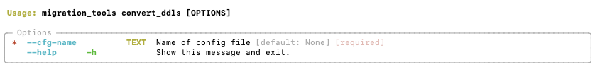

# Convert DDLs

Use this command to convert sql DDL scripts placed in the input/ddl/<platform> folder to DBSchema model files (.DBS), which can be processed by the validate_models and migrate_yaml commands.
The script will place the generated *.DBS files in the input/model/<platform> folder. 

!!! info "You can only use DDL scripts as import if you have DBSchema installed."

    To use DDL scripts as input you would need to have license to DBSchema and have installed as this will be used to convert the DDLs into a DBSchema model file, which is then processed by validate models command. If you don't have DBSchema, you can use CSV files as input and place them in the input/model/<platform> folder.

## CLI preview
=== "convert_ddls --help"
  
    

