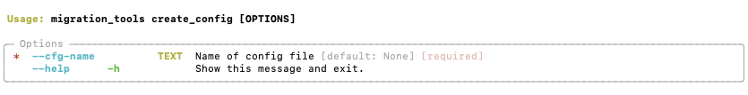

# Create Config

Sets up the required folder structure for migration tools and creates a template configuration file in the config folder with the name of the project. This .toml file will need to be edited before the first run.

## Folder structure

The following folder structure will be created under the project folder 

```bash
├── <projects>
│   ├── <project_name>
│   │   ├── config
│   │   │   ├── <project_name>.toml
│   │   ├── input
│   │   │   ├── business_model
│   │   │   │   ├── <business_model>.xls
│   │   │   ├── connections_yaml
│   │   │   │   ├── <original_remapping_file>.yaml
│   │   │   ├── ddl
│   │   │   │   ├── falcon
│   │   │   │   │   ├── **/*.sql
│   │   │   │   ├── target
│   │   │   │   │   ├── **/*.sql
│   │   │   ├── models
│   │   │   │   ├── falcon
│   │   │   │   │   ├── **/*.dbs
│   │   │   │   │   ├── **/*.csv
│   │   │   │   ├── target
│   │   │   │   │   ├── **/*.dbs
│   │   │   │   │   ├── **/*.csv
│   │   ├── log
│   │   │   ├── <yyyymmdd_HHMMSS>_migration.log
│   │   ├── output
│   │   │   ├── delta_migrations
│   │   │   │   ├── cs_tools_cloud
│   │   │   │   ├── cs_tools_falcon
│   │   │   │   ├── modified
│   │   │   │   ├── new
```

## Configuration file

The process will also create a template configuration file with the same name as the project in the config folder of the created directory structure. Please adjust these parameters according to your needs, althought typically you would only need to change the MIGRATION parameters (source and target platform).

```toml
[MIGRATION]
# Name of the source platform
SOURCE_PLATFORM="FALCON"
# Name of the target platform
TARGET_PLATFORM="REDSHIFT"

[FILE_LOCATIONS]
# Folder where the source model files will be placed (*.dbs/*.csv)
SOURCE_MODEL_FOLDER = "./projects/cmc/input/models/falcon/"
# Folder where the target model files will be placed (*.dbs/*.csv)
TARGET_MODEL_FOLDER = "./projects/cmc/input/models/target/"
# Folder where the business model downloaded from the source platform (falcon) will be placed
BUSINESS_MODEL = "./projects/cmc/input/business_model/model.xls"
# File Spec (folder+name) of the source remapping.yaml file
SRC_YAML_FILE_NAME = "./projects/cmc/input/connections_yaml/org_cmc_dummy_connection.yaml"
# File Spec (folder+name) of the output comparison report
DDL_COMPARISON_REPORT = './projects/cmc/output/ddl_comparison.txt'
# File Spec (folder+name) of the output remapped yaml file
TAR_YAML_FILE_NAME = "./projects/cmc/output/remapped_org_cmc_dummy_connection.yaml"
# File Spec (folder+name) of the override csv file
MANUAL_OVERRIDES = "./projects/cmc/output/mapping_overrides.csv"

[MODEL_VALIDATION]
# Names of source databases which will be completed excluded from the process
EXCLUDE_DATABASES = ['thoughtspot_internal','thoughtspot_internal_stats','34ae4719-2593-4ed4-ac3e-0ac797f0e7af']
# Names of source schemas which will be completed excluded from the process
EXCLUDE_SCHEMAS = ["ViewDatabase.ViewSchema"]
# Do we ignore the length on any Falcon varchar data type
IGNORE_FALCON_VARCHAR_PRECISION = true
# Do we accept target data types with a larger length and/or precision?
ACCEPT_LARGER_TARGET_LENGTH_DECIMAL = true
# In the output report do we only list tables which have actual issues
ONLY_REPORT_TABLES_WITH_ISSUES = true
# The minimum percentage of column similarity to be required
MIN_COLUMN_SIMILARITY_PCT=20
# The minimum amount of columns a table needs to have for a successful column match
MIN_COL_COUNT_FUZZY=2
# Width of the report (and terminal)
REPORT_WIDTH_COLS=160
# If set True it will populate target definition in the override file with value of source (and target data type)
COPY_SOURCE_DEF_WHEN_NOT_FOUND=false
# Minimum score required for a successful match
MINIMUM_SCORE_FOR_MATCH=15

[DELTA_MIGRATION]
SOURCE_TS_URL = "https://123.456.789"
SOURCE_USERNAME = "username"
SOURCE_PASSWORD = "password"
DEST_TS_URL = "https://789.456.123"
DEST_USERNAME = "username"
DEST_PASSWORD = "password"
```

## CLI preview
=== "create_config --help"
  
    


