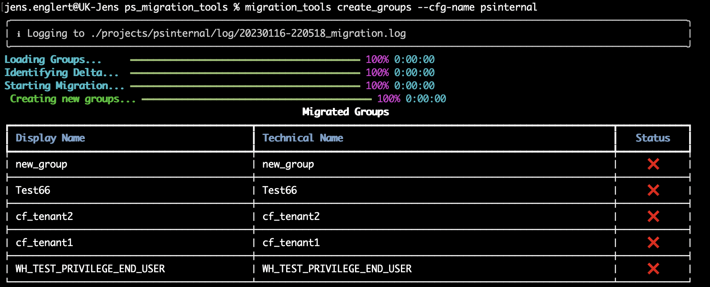

The `create_groups` function will create all missing users by looking at the `deltas` output. 

~~~
usage: create_groups [-h] [--cfg-name CONFIGNAME] [--validate-only yes/no]

                     
arguments:
  -h, --help          show this help message and exit
  --cfg-name          Name of the config file
  --validate-only     yes/no 
   
~~~
## CLI preview
=== "create_groups --help"
  
    