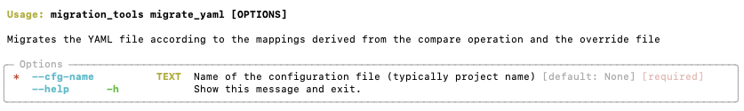

# Migrate YAML

This command will perform the actual remapping of the connections YAML file. It will always perform a final validations step before it starts migrating and it requires the validation to be successful and all overrides properly set in the overrides.csv file. The end result is a remapped connection file which will be placed in the output folder.

## CLI preview
=== "migrate_yaml --help"
  
    

