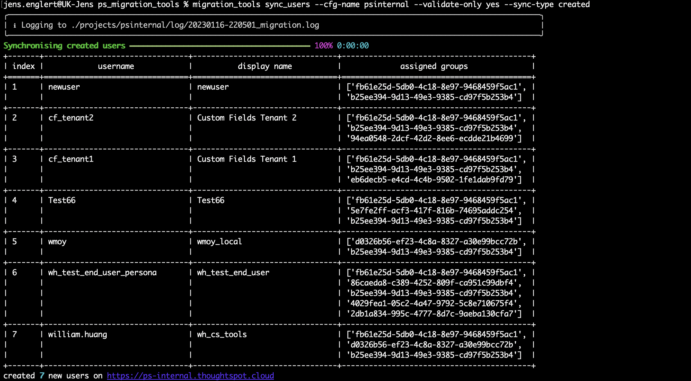

The `create_users` function will create all missing users by looking at the `deltas` output. 
This command does not run a full user sync, it only creates missing users on the target cluster. Make sure you run a full user/group sync at the end of the migration. 

~~~
usage: create_users [-h] [--cfg-name CONFIGNAME] [--validate-only yes/no]

                     
arguments:
  -h, --help          show this help message and exit
  --cfg-name          Name of the config file
  --validate-only     [yes/no]
   
~~~
## CLI preview
=== "create_users --help"
  
    