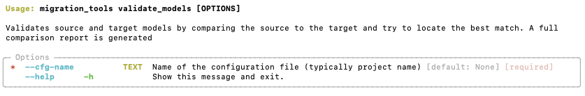

# Validate Models

The validate models command allows you to very quickly compare the source model to the target model, often in seconds.

## Required Inputs

The command requires three types of input:

  - Source DDL(s) with extension .sql placed in the /input/ddl/falcon folder or CSV(s) directly placed in the /input/model/falcon folder.
  - Target DDL(s) with extension .sql placed in the /input/ddl/target folder or CSV(s) directly placed in the /input/model/target folder.
  - Source ThoughtSpot Business Model, placed in the /input/business_model folder


## Preparation

=== "Using DDL scripts"

    !!! info "You can only use DDL scripts as import if you have DBSchema installed."

        To use DDL scripts as input you would need to have license to DBSchema and have installed as this will be used to convert the DDLs into a DBSchema model file, which is then processed by validate models command. If you don't have DBSchema, you can use CSV files as input and place them in the input/model/<platform> folder.

    Before you can run the validate_models or migrate_yaml command, you will need to convert the DDL files to model files. See the convert_ddl command for more information on how to do this.

    !!! warning "DDL scripts can only contain content of 1 database"

        When using DDL scripts, each DDL script can only contain the content of 1 database. The name of the script will be used as the database name.

=== "Using csv files"

    If you don't have a licensed copy of DBSchema, you can just use CSV files which provide the same functionality. The CSV files do not have headers and contain the following information

    | Column              | Description                    | Example     |
    | ------------------- | ------------------------------ | ----------- |
    | Database Name       | Name of the database           | my_database |
    | Schema Name         | Name of the schema             | my_schema   |
    | Table Name          | Name of the table              | my_table    |
    | Column Name         | Name of the column             | my_column   |
    | Base Data Type      | The data type of the column    | NUMBER      |
    | Data Type Length    | The length of the data type    | 18          |
    | Data Type Precision | The precision of the data type | 3           |

    For example:
    ```csv
    my_database,my_schema,my_table,my_column,NUMBER,18,3
    ```

    !!! info "CSV files can contain multiple databases"

        Unlike when using DDL files, CSV files have the database name inside the row data and therefore can contain content from multiple databases.

## CLI preview
=== "validate_models --help"
  
    

