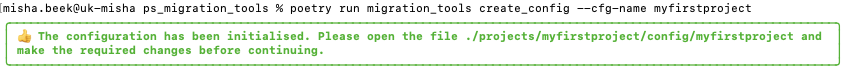
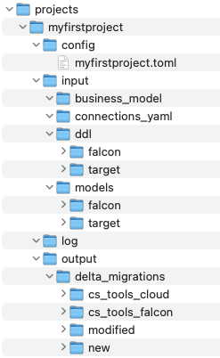

# Creating a configuration file

Whenever you are starting a new migration project, there are two steps you need to take to prepare your enviroment and set up your project:

    1. Set up the directory structure and create a template project configuration file
    2. Set/Adjust the settings in the project configuration file according to the needs of your project

## Setting up the directory structure and template configuration file

There is a command in migration_tools, which will take care of that for you and that is the create_config command. Please see the command [create-config](../../migration-tools/create-config/readme) for more details on how this command works.

You can run the following command to set up the structure and template configuration file for a project called **myfirstproject**

```bash
poetry run migration_tools create_config --cfg-name myfirstproject
```

If everything went well, the following message will be presented on your screen:


The directory structure has now been created and a template configuration file has been created.



## Tweaking the project configuration file

In the folder projects/myfirstproject/config/ a template configuration file has been created for your project with the name myfirstproject.toml. You will now need to tweak these settings for the needs of your project.
