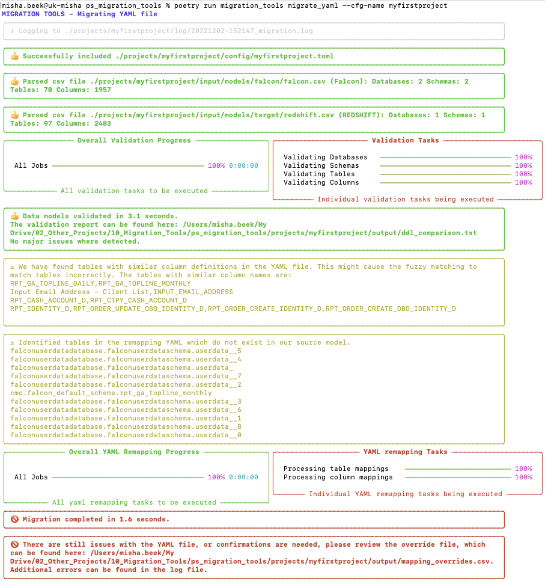
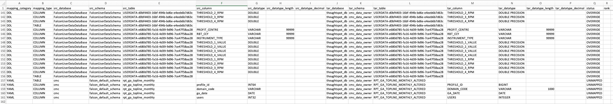
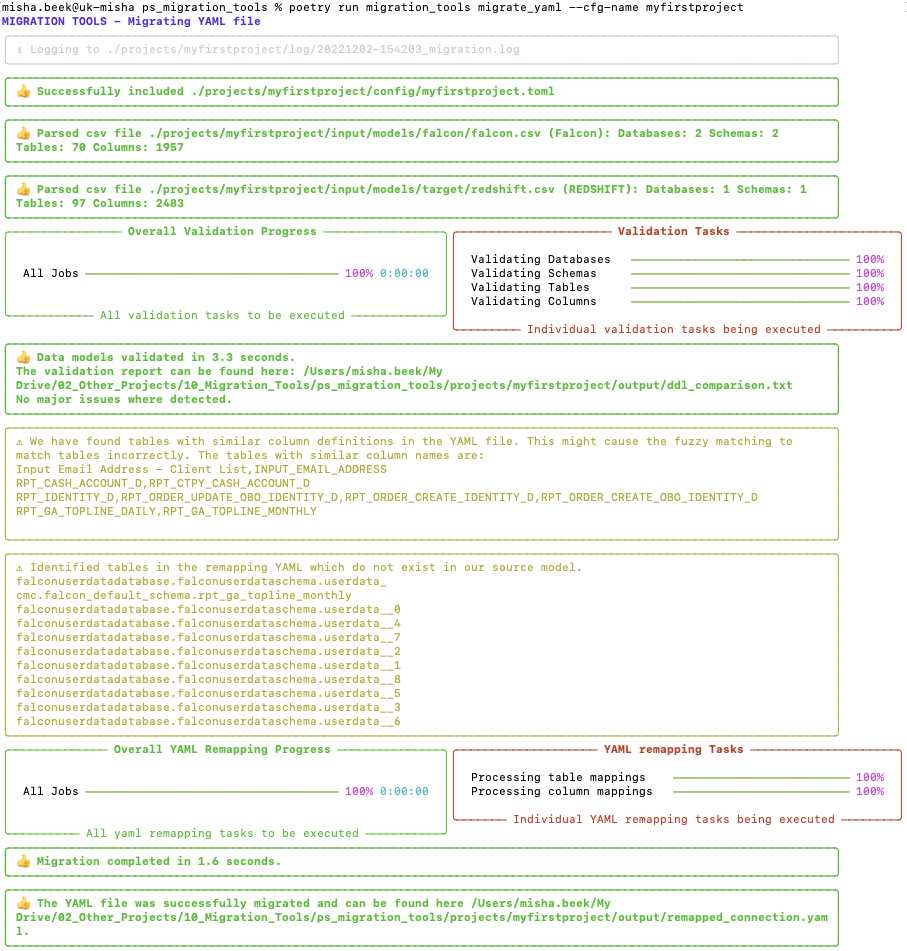

# Remapping a Connections File

## Prerequisites

To be able to remap the connections, we need of course the original remapping file. This original yaml file needs to be downloaded from the new target cluster after the migration pipeline has completed and the backup has been restored. This this will need to be placed in the /projects/myfirstproject/input/connections_yaml folder.

You see that it first does a validation again. The reason for this is to make sure everything is still valid and during that validation it will collect the mapping rules it needs to be able to perform the remapping.
It also raised two warnings. The first warning is to inform you that there are a number of tables in the YAML file with very similar definitions. This is just to let you know it might be possible that incorrect mappings might be made (in case when two tables are completely identical). The other warning is that it has identified tables in the YAML file which did not exist in our original source model. For the user uploaded tables this is typical, as due to an issue in the migration pipeline, they will have different names, but don't worry the migration tools will fix that.

And finally you see that the remapping has failed. It still encountered an issue, which needs to be resolved. We will need to open the override file to fix this.

At the bottom of the file you see a few new entries with YAML in the first column, which are unmapped. It was not able to locate the table rpt_ga_topline_monthly directly initially, but was able to map it to RPT_GA_TOPLINE_MONTHLY_ALTERED via the same fuzzy matching process. You might have noticed that this table was already mentioned in one of the warnings earlier. So if we are happy with this mapping we can just switch the status to OVERRIDE to accept them.

Now we can just rerun the process.

And everything went through now and it stored the remappings in a file called remapped_connection.yaml
