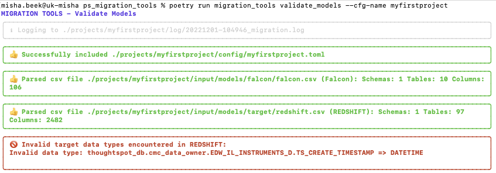
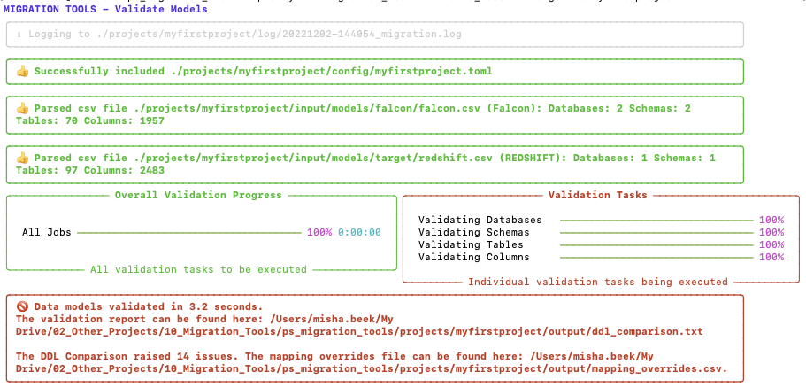
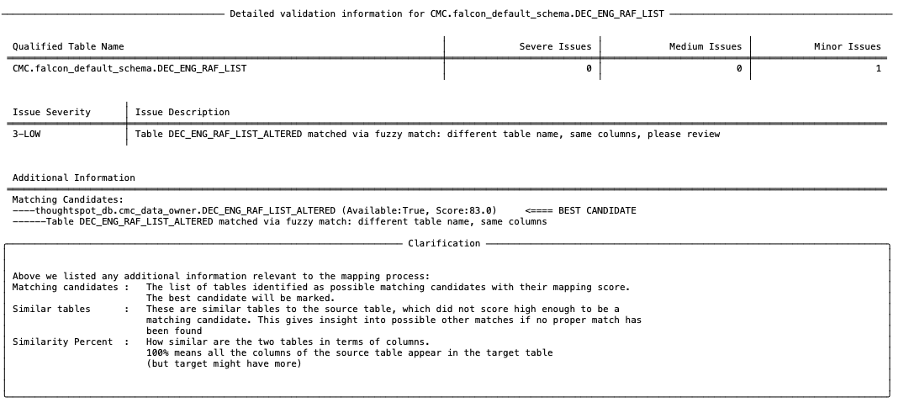
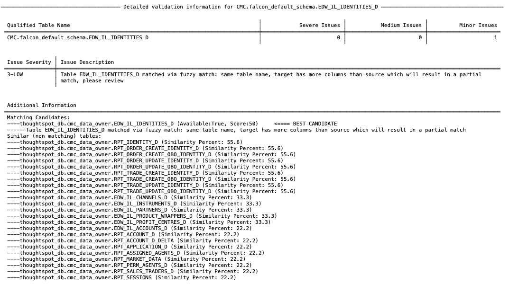
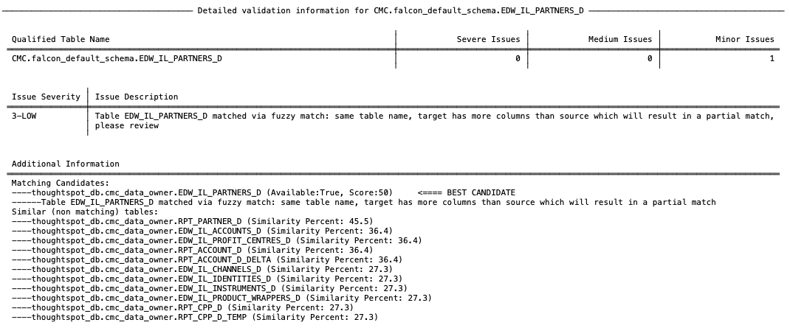
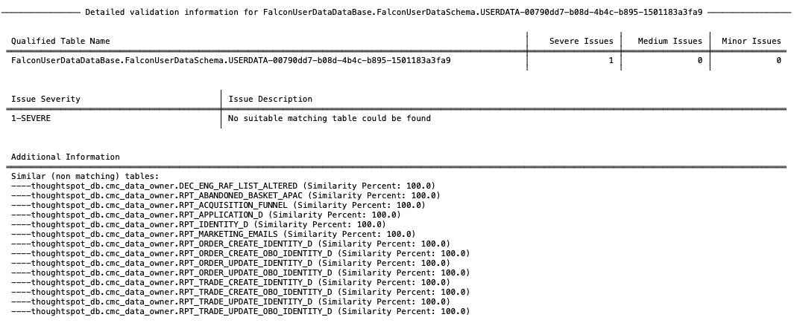

# Running a Model validation

!!! info "Make sure you have configured migration_tools before you run this step."

    For the validation process to run smoothly, make sure you have setup and configured migration_tools for your project, as described in [Setup a Config File](../../tutorial/config)

## Prerequisites

To run a validation we need three inputs:

    * A source model, which can be a CSV or DBS file, but we are using a CSV file here
    * A target model, which can be a CSV or DBS file, but we are using a CSV file here
    * The ThoughtSpot business model downloaded from the source platform

We will place the falcon.csv, which is the source definition file in the /projects/myfirstproject/input/models/falcon folder. Similarly we place the redshift.csv file in the /projects/myfirstproject/input/models/target folder.
Finally, we place our downloaded source business model (xls) in the /projects/myfirstproject/input/business_model folder.

## Running the validation

We are now ready to perform our first validation run, by executing the validate_models command:
```bash
poetry run migration_tools validate_models --cfg-name myfirstproject
```

Which will render the following output on the screen:



We see an error is detected straight away, and that is that an incorrect data type has been encountered in the target definition. This is the only case where the process halts immediatly as it is a critical error and prevents the process from parsing the structures correctly. If the target models are correctly extracted by the client, this should not really happen, but sometimes people cut corners or copy and paste and that is why this protection is built-in.

It is reported that the column TS_CREATE_TIMESTAMP in table thoughtspot_db.cmc_data_owner.EDW_IL_INSTRUMENTS_D has been defined as DATETIME. This is not a valid data type for RedShift (should be TIMESTAMP). The action to take here is notify the client and find out how this could have happened. At the same time you can correct it yourself in the target definition by changing it to the appropriate TIMESTAMP data type.

We can now run the validation again.



What we can see here is:

    - It successfully loaded the configuration file for the myfirstproject project
    - It parsed both input csv files successfully
    - It executed the mapping process, which completed in 2.4 seconds
    - It detected 13 issues, which have been documented in the report ddl_comparison.txt
    - It also created an overwrite file in which the suggested mappings are document

### Reviewing the mapping report

Lets examine the mapping report in more detail by opening it and see what the issues are. On top of the report we can see in the header that we have performed a validation between a Falcon source platform and a Redshift target platform.


If we scroll a bit further down we see an overview of what has been analysed in terms of number of objects.


We see here that in total the validation process analysed 3 databases, 3 schemas and 167 columns in 2.4 seconds.

The next section will show you all project mappings, which includes all tables which could be directly mapped or which the process was able to map based on fuzzy mapping and similarity. It will also list the score of each mapping (0-100).


The majority of mappings have a score of 100.0, which means they were a perfect match. However, there are 3 mappings with a score lower than 100.0 and even 10 with a score of 0.0. These are mappings we will need to investigate. Below this table in the report it also gives you a clarification of the scoring system, which is as follows:

| Score       | Explanation                                                                           |
| ----------- | ------------------------------------------------------------------------------------- |
| 100.0       | Perfect Match:                                                                        |
|             | - Same table name (case insensitive)                                                  |
|             | - Same columns (fuzzy matched) and same number of columns                             |
| 75.0 - 85.0 | - Different table names                                                               |
|             | - Same columns (fuzzy matched) and same number of columns                             |
|             | - The closer the number is to 85, the more similar the two table names are            |
| 50.0        | - Same table name (case insensitive)                                                  |
|             | - Source columns are present in target table, but target table has additional columns |
| 25.0 - 35.0 | - Different table names                                                               |
|             | - Source columns are present in target table, but target table has additional columns |
|             | - The closer the number is to 35, the more similar the two table names are            |
| 0.0         | No suitable match found                                                               |

The next table in the report lists all the tables with issues:


And here we can see that there were in fact 14 issues, 13 we already knew about from the mapping scores, but the process also detected something else. Now we can investigate in detail, what all the issues actually are. All the subsequent sections in this report are detailed results per table.
We are going to start with the first issue report for mapping table DEC_ENG_RAF_LIST.



We see here that it is only reported as a minor issue. And the issue is that the process could not find a perfect match, but via its fuzzy matching algorithm it did find a good candidate. It found a table which has a different name DEC_ENG_RAF_LIST_ALTERED, but has the same matching columns. It generated a score of 83, as the initial score was 75, but that has been increased based on the similarity of the table name.

If we are happy, with this suggestion we can confirm it by marking it in the override file and run the process again. How to mark suggestions in the override file we will see in the next section, after we have reviewed all the issues.

For now, we going to look at the next issue, which was with table EDW_IL_IDENTITIES_D.



This is also a minor issue as it could not find a perfect match. However, it is slightly different than the previous one. In this case it did find a match on table name and similarity in columns, however, the target column has additional columns which do not exist in the source. This is a valid situation and can be successfully remapped, but it is always recommended to review them.

Similar as before, if we are happy with this mapping, we can confirm it later in the override file.

If we look at the final minor issue, we see it is a similar issue as the previous one, so we can deal with it in the same way.



Now let's look at the RPT_DEBT table, as it was reported there was a problem there too:


Note that this mapping still has a score of 100 as it was able to work out what the correct target table is, but there is a different issue here and that is that the data types don't match. The column BUSINESS_DATE is defined as DATE on the source model, but on the target it is defined as a VARCHAR(100) and these are not compatible. This is probably the most common issue in validations and this command will find them all.

The resolution here is to inform the client that they will need to change the target data type. And we can confirm this change in the override file later.

Now let's move on to the severe issues. The first one is reported on FalconUserDataDataBase.FalconUserDataSchema.USERDATA-00790dd7-b08d-4b4c-b895-1501183a3fa9, which is a user uploaded table.



The issue is clear here. The process was not able to find any suitable match for this table, which means there is not a table which even looks a little bit like this table, so it is most likely missing on the target system.
The solution here is to notify the client that this table is missing and they will need to create it. 
However, if you can agree the name with the client, you can already specifiy this in the override file and continue your validation.

If we review the remaining 9 severe issues, we can see they are the same issue (missing table), which means we can deal with those the same way as the previous one.

### Fixing issues and confirming suggested mappings in the override file

We have done our first run now and identified all the initial issues. We don't have necessarily to wait for the client to make all the changes, we can do it ourselves (as long as the client will stick to making the identical changes). For one issue (the incompatible data type on RPT_DEBT) we need to fix the target model input file, which we can do easily by amending the csv file.

So open the target model file (redshift.csv in our case), find the column and correct the data type.

To confirm all other suggested changes, we can do this in the mapping_overrides.csv file. You can open this file with your favourite spreadsheet editor and it will look similar as the image below.


The override contains the following columns:

| Column Name          | Description                                                                                    |
| -------------------- | ---------------------------------------------------------------------------------------------- |
| mapping_category     | DDL or YAML, depends on which process added this mapping row                                   |
| mapping_type         | Either TABLE or COLUMN, TABLE for just the table mapping, COLUMN for the column mappings       |
| src_database         | Name of the source database                                                                    |
| src_schema           | Name of the source schema                                                                      |
| src_table            | Name of the source table                                                                       |
| src_column           | Name of the source column                                                                      |
| src_datatype         | Data type of the source column                                                                 |
| src_datatype_length  | Length of the source column data type                                                          |
| src_datatype_decimal | Precision of the source column data type                                                       |
| tar_database         | Name of the target database                                                                    |
| tar_schema           | Name of the target schema                                                                      |
| tar_table            | Name of the target table                                                                       |
| tar_column           | Name of the target column                                                                      |
| tar_datatype         | Data type of the target column                                                                 |
| tar_datatype_length  | Length of the target column data type                                                          |
| tar_datatype_decimal | Precision of the target column data type                                                       |
| status               | Status of the mapping, default UNMAPPED, change to OVERRIDE to accept the mapping on this line |
| rank                 | Score of the mapping (only set for tables)                                                     |

Basically each row contains a source to target mapping. For a table there will be a row for the table mapping and rows for each column. Where a mapping has been identified by the process it will have populated the target already. For tables where no match has been found, the target part of the table and column mappings will be left empty. The override file will only list the mappings with a score lower than 100, i.e. the mappings which need to be fixed or confirmed.

To deal with the identified issues, we can do the following:

    1. For the issues with tables DEC_ENG_RAF_LIST, EDW_IL_IDENTITIES_D and EDW_IL_PARTNERS_D we can just confirm the mappings by changing the value in the status column to OVERRIDE to accept the suggested mappings.
    2. For the issue with RPT_DEBT (the incorrect data type), we can fix the data type by setting the target data type to DATE and set the mapping status to OVERRIDE
    3. For the missing tables - assuming that you have agreed with the client that they will create them with the exact same names, columns and data types, we need to do the following: 
       1. Populate the target fields by copying the source table, columns and data types to the target fields.
       2. Make sure the target data types are supported by the target system and change them where necessary
       3. Agree with the client the name of the target database/schema where these objects will be created and set these in the target database and target schema column
       4. Change the mapping status to OVERRIDE for these rows

!!! warning "Data Types for Validation overrides should be Target Data Types"

    When providing overrides in the overrides.csv it is important to provide the correct data types for the target. In the case of overrides during the validation, they will need to be the data types from the target platform. However, for YAML overrides it will need to be data types from ThoughtSpot (INT32, INT64, VARCHAR, etc)


### Rerunning the validation with overrides

We can now rerun the validation.


And the validation passed, because we have fixed/overridden the issues and we are ready to remap to connections file. 

